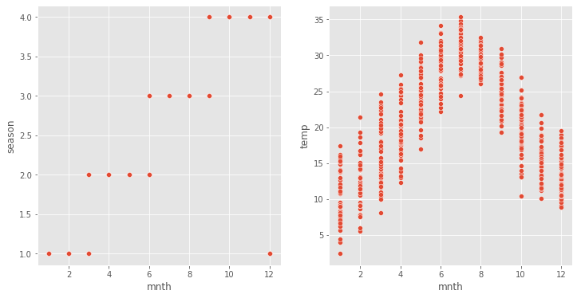

# Bike Sharing Assignment
In this project we had model the demand for shared bikes with the available independent variables.

## Table of Contents
* [General Info](#general-information)
* [Important Corrections](#important-corrections)
* [Conclusions](#conclusions)
* [Final Model](#final-model)
* [Model interpretation](#model-interpretation)
* [Overall impression](#overall-impression)
* [Technologies Used](#technologies-used)
* [Acknowledgements](#acknowledgements)

<!-- You can include any other section that is pertinent to your problem -->

## General Information
- A US bike-sharing provider BoomBikes has recently suffered considerable dips in their revenues due to the ongoing Corona pandemic. The company is finding it very difficult to sustain in the current market scenario. So, it has decided to come up with a mindful business plan to be able to accelerate its revenue as soon as the ongoing lockdown comes to an end, and the economy restores to a healthy state. 
- The project is trying to find out which variables affect the bookings for bikes so that the company can plan their business strategy to meet the demand for bikes.
- day.csv contained 730 data points with 16 columns. Readme.txt contained the explanation for the columns.

<!-- You don't have to answer all the questions - just the ones relevant to your project. -->

## Important Corrections

- seasons are labeled as 1: spring, 2: summer, 3: Fall, 4: Winter
- But a plot of season vs month and season vs temp shows that season labels are wrong
- According to the data months for spring are Dec, Jan, Feb, Mar
- But actual months for spring are Mar, Apr, May, Jun
- The temperature plot confirms this.
- __Seasons labels are corrected as: 1: Winter, 2: Spring, 3: Summer, 4: Fall__  
- [wiki link seasons](https://en.wikipedia.org/wiki/Season)  
    
  
- Weekday and workingday were also labelled wrongly
- This was confirmed after inspecting date column
- The values for weekday and workingday were corrected  

## Conclusions

- We performed EDA to explore the data
    - We removed some outliers
    - We dropped one obvious feature - temp
- We split the data into train-test
- Test-train split was 80-20% to keep more data for training. Also we were not creating validation set in this assignment.
- We trained a linear regression model using statsmodels and observed p-values and VIF
- We started with 27 features and initial adjusted R-square of 0.835
- __6 models were evaluated and one of them was chosen__, 
- Models were chosen based on p-values and VIF we trimmed features to make our model simpler without sacrificing too much of initial adjusted R-square

## Final Model

- __The final model has 9 features.__
- Train set adjusted r2_score is 0.812. Thus it explains 81.3% variability of the data set.
- It has a test set r2_score of 0.821. Thus 82.1% variability is explained.

## Model interpretation

|Feature|Coefficient|Description|Interpretation|
|---|---|---|---|
|temp|3688.85|Daily temperature|Bookings increase with higher temperatures|
|yr|2079.63|Year|As popularity increases bookings will increase|
|season_4|1501.95|Fall season|Fall season will produce the most bookings - this is expected as people would like to enjoy "fall colors" while riding a bike|
|season_2|1225.23|Spring season|Spring season will also produce good bookings because of pleasant weather|
|season_3|938.28|Summer season|Summer season will increase bookings, but not as much as fall and spring|
|weather_2|-590.98|misty,cloudy|Bookings decrease slightly on cloudy days|
|windspeed|-773.71|Wind speed|Bookings will decrease on windy days|
|holiday|-774.90|holiday (yes)|Bookings will decrease on holidays|
|weather_3|-2323.50|Thunderstorm snow and rain|__Very high negative impact on bookings. bookings drop drastically when weather is bad__|

### Overall impression
- Good weather (Fall/Spring, good temperature, less wind, no rain/snow) will bring more bookings.
- As popularity increases bookings will increase.

### Month
- Month was dropped to simplify the model. 
- It had high p-values. 
- Another alternative would be to drop season and keep month. 
- But this gave similar R2_score and so season was kept.

<!-- You don't have to answer all the questions - just the ones relevant to your project. -->

## Bonus
- Also tried gradient boosting regressor to get:
    - Train r2_score  89%
    - Test r2_score   84%
- This was only a slight improvement over 81.1% of linear regression and seems to have overfitting.

## Technologies Used
- Python 3.9
- sklearn 1.0.1
- statsmodels 0.13.1

<!-- As the libraries versions keep on changing, it is recommended to mention the version of library used in this project -->

## Acknowledgements
- [wiki link seasons](https://en.wikipedia.org/wiki/Season)  

## Contact
Created by [@nvkhedkar] - feel free to contact me!

<!-- Optional -->
<!-- ## License -->
<!-- This project is open source and available under the [... License](). -->

<!-- You don't have to include all sections - just the one's relevant to your project -->